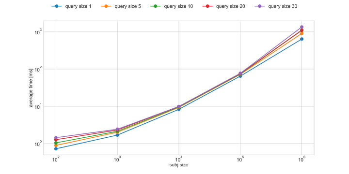
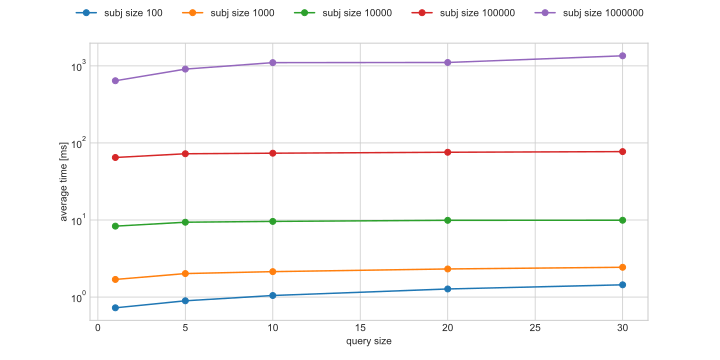
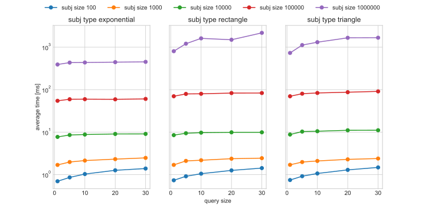
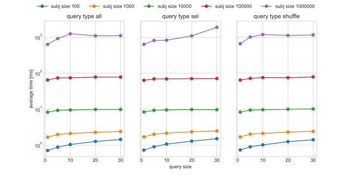
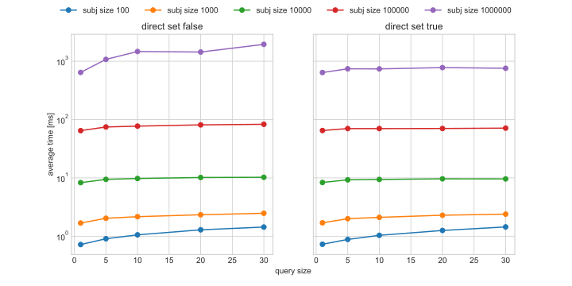

# TreeQuery: Technical Report

This report summarizes the implementation of the *TreeQuery* library.
TreeQuery can be used to query structures within a *subject tree*.
The *query* structure is also a tree, but does not need to exactly match a subtree of the subject tree depending on the mode settings.

Refer to the [specification](specification.md) for a description of the terminology and matching modes.

## Matching Implementation

Refer to the [architecture description](architecture.md#matching-implementation) for a description of the matching implementation itself.

### Performance Considerations

The implementation makes use of the lazy evaluation of Java Streams.
This provides an easy way to only evaluate as many states as necessary.
In most cases it is sufficient to find only the first match end ignore any additional matches.

The disadvantage of this approach is the lack of caching partial results (similar to what would be done in a dynamic programming algorithm).
This becomes apparent when some child queries match multiple nodes in the given subtree:
Assume the first child query matches `k` different nodes.
Even with lazy evaluation, the second child query needs to be executed once for *each* result of the first child query in the worst case.
This causes `k` runs, even though a single run would be sufficient.
This becomes even worse if more child queries match multiple nodes, as the number of results to check then grows exponentially.

On the other hand, classic caching without eager evaluation is not possible for streams since they can be evaluated only once.
This problem is circumvented by wrapping streams in a lazily filled cache:

* The cache consists of an (initially empty) list and a spliterator wrapping the stream's spliterator.
* Each caller can obtain its own copy of a stream, which is the concatenation of the list stream and the wrapping spliterator.
* Whenever the wrapping spliterator is invoked, an item is obtained from the stream and appended to the list.
* This construction allows elements to be replayed, but only loaded when they are needed.

The cache is especially useful if a later child query does not match anything in the subtree, which can be determined in a single run.

The cache is only scoped to each invocation of the parent query (as opposed to classic dynamic programming).
Since a different parent result generally implies a completely different search space for the child queries,
a global cache would only consume memory with little or no benefit.

Using this caching strategy resulted in a huge impact on the runtimes of large subjects (see section below):

* On subjects with 100000 nodes, all queries completed in less than half a second,
  whereas some did not produce any result at all in a 15 minutes time limit without caching.
* On subjects with one million nodes, some queries still ran for more than a minute.
  However, this is still an enormous improvement compare to no caching, where many queries did not give results within 15 minutes.
* Overall, caching improved average runtimes by a factor of more than 10.

### Potential Limitations

Most logic of the library is implemented recursively, which puts a restriction on the maximal tree height.
For this reason, the highest trees used for benchmarking below could not be loaded with the standard stack size limit of 1MB.
It should be considered, though, that these trees have a height of about 1400, which in many practical cases will not occur.
Furthermore, a slight increase in the maximum stack size (in this case, to 2MB) increases this height limit.

Another potential problem with large instances is the memory usage, since the whole tree is loaded into memory.
This is clearly necessary in some cases, but in many practical instances loading children on-demand only might be sufficient.
Such behaviour could, however, be easily implemented in custom implementations of the `SubjectNode` interface if necessary.
Even the largest instances used for benchmarking (see below) did not exceed the default maximum heap size of 4GB.

Furthermore, the library does not use parallelization, and therefore does not utilize multicore processors.
However, in many practical scenarios, running multiple queries in parallel (rather than a single query on multiple cores)
is probably more useful anyway.

## Benchmarks

The following benchmarks were executed on a desktop machine running Kubuntu 21.10.
The machine was equipped with an Intel i5-4460 desktop CPU at a clock rate of 3.20 GHz and 16 GB or RAM.
Since the library does not use multithreading, full utilization of a single core at almost all times can be expected.
Similarly, the total available RAM was not considered to be any limitation, since the maximum heap size of the JVM was set to the default of 4GB.
Runtimes were measured as nanoseconds CPU time using
[ThreadMXBean](https://docs.oracle.com/en/java/javase/17/docs/api/java.management/java/lang/management/ThreadMXBean.html#getCurrentThreadCpuTime()).

The performance was tested using 30 subjects of different sizes and a total of 10972 queries.
Each query is run against the corresponding subject 21 times, with the first result discarded
and the average runtime determined as the average of the remaining 20 runs.

The randomized generation described in the following uses a fixed seed (specifically: `0`) to make results reproducible.

### Subject Structure

Subjects are constructed for 5 different sizes (1E2 to 1E6, increasing by factor 10).
The subjects have different shapes, which determines the number of nodes on each level.
Nodes are then randomly distributed among the nodes of the level above.

The following shapes are used:
* Rectangular tree: The number of nodes on each level is equal (except for the single root),
  i.e. the size of the tree is given by `height` times `width`.
  Two different ratios of `height` and `width` are used (`0.5` and `2.0`).
* Triangular tree: The number of nodes grows linearly with the depth.
  Two different width factors are used (`2` and `4`).
* Exponential tree: Each node has the same number of children on average, i.e. the number of nodes grows exponentially with the depth.
  Two different numbers of children are used (`3` and `6`).

This produces high trees for rectangular and triangular type (height around 1000 for the largest subjects)
and flat trees for the exponential tree (height around 10 for the largest subjects).

### Query Structures

Queries are generated for each subject by first selecting a start node
and then recursively selecting subtrees and individual nodes to include:

* For each subject, five start nodes at evenly distributed depths are chosen.
* For each start node, three different selection modes are used:
  * Exactly one node from each subtree (but not necessarily the root of the subtree).
  * Up to one node from each subtree (i.e., some subtrees are omitted).
  * At least one node from each subtree in shuffled order.
* For each selection, different container modes are set (`exact` for the first, `ordered` for the second, `unordered` and `any` for all).
* Each query is created once with the `direct` flag set if applicable and once without.
* Each query is truncated to sizes `1`, `5`, `10`, `20`, and `30`.

In theory, this gives 450 queries per subject.
However, some selections of nodes are smaller than the larger query sizes, which are then omitted.
This is often the case for start nodes deep in the tree.
In total, 10972 queries were created, or about 365 per subject on average.

### Results

Using a script to aggregate the runtimes on different parameters of the subjects and queries, the following results could be observed:

* The average runtime appears to grow faster than polynomially with the subject size,
  as can be seen in the following plot (note that both scales are logarithmic):

  

* The previous plot already suggests only very little impact of the query size, which can also be seen in the following plot:

  

* The queries on the rectangular and triangular subjects seem to be slightly slower for large instances.
  This suggests that the subject height possibly has more impact on the runtime than the total subject size.

  

* The limitation of the query to only some subtrees (query type "selected") seems to have a negative impact for the largest instances.
  Since these query trees have larger height compared to other queries of the same total size
  this suggests the query height is more important for performance than the query size.

  

* Setting the `direct` flag seems to improve the runtime slightly on large instances, as can be seen in the following plot.
  This comes as no surprise, as it reduces the search space immensely.

  

* The other parameters seem to have very little impact on the runtime, which can be seen in the [other plots](figures).

CSV files with the individual and aggregated runtimes can be found in [runtimes](runtimes).

## Conclusion

The experimental results suggest that the runtime of the given implementation grows
slightly faster than polynomially in the size of the subject for the average case.
Nevertheless, the results are reasonably fast even for large instances.
A major factor in these runtimes is the caching of partial results while still keeping the lazy evaluation approach.

Even though a theoretical analysis of the worst-case runtime remains open,
the results suggest some dependency on the height of the subject and query tree.
Such factor would not be surprising, as the runtime is dependent on the height for many algorithms on trees.

It should be noted, though, that the subjects and queries used for this experimental evaluation are very limited.
Therefore, runtimes for both worst-case examples and practical cases might be represented badly.

Possible improvements to the library could include lazy loading of children in the subject tree.
